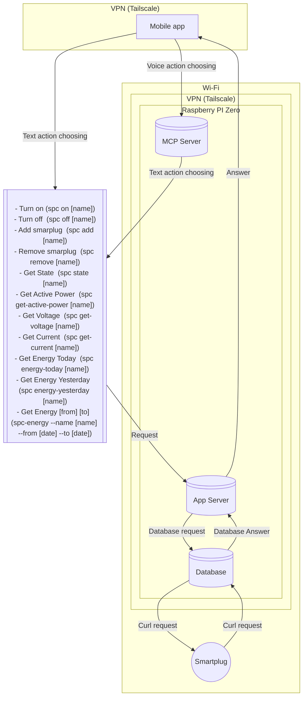

# App-Plug
Mobile app for smart-plug managing

# Schema

```mermaid
graph TD
    subgraph "VPN (Tailscale)"
        A[Mobile app]
    end
        B@{ shape: subproc, label: "
        - Turn on (spc on [name])
        - Turn off  (spc off [name])
        - Add smarplug  (spc add [name])
        - Remove smarplug  (spc remove [name])
        - Get State  (spc state [name])
        - Get Active Power  (spc get-active-power [name])
        - Get Voltage  (spc get-voltage [name])
        - Get Current  (spc get-current [name])
        - Get Energy Today  (spc energy-today [name])
        - Get Energy Yesterday  (spc energy-yesterday [name])
        - Get Energy [from] [to]  (spc-energy --name [name] --from [date] --to [date])
    " }
    subgraph "Wi-Fi"
    subgraph "VPN (Tailscale)"
        subgraph "Raspberry PI Zero"
        C@{ shape: lin-cyl, label: "App Server" }
        D@{ shape: lin-cyl, label: "Database" }
        E@{ shape: lin-cyl, label: "MCP Server" }
    end
    end
        F@{ shape: circle, label: "Smartplug" }
    end

    A -- "Text action choosing" --> B
    A -- "Voice action choosing" --> E
    B -- "Request" --> C
    E -- "Text action choosing" --> B
    C -- "Database request" --> D
    D -- "Database Answer" --> C
    D -- "Curl request" --> F
    F -- "Curl request" --> D
    C -- "Answer" --> A
```
