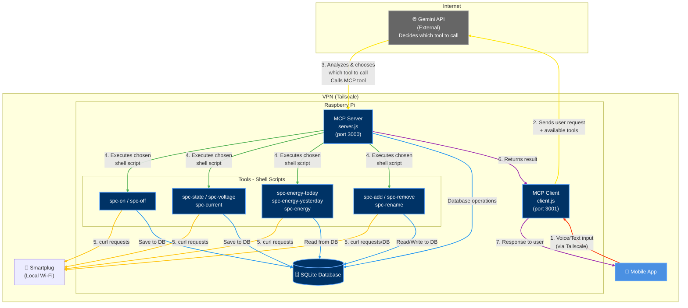
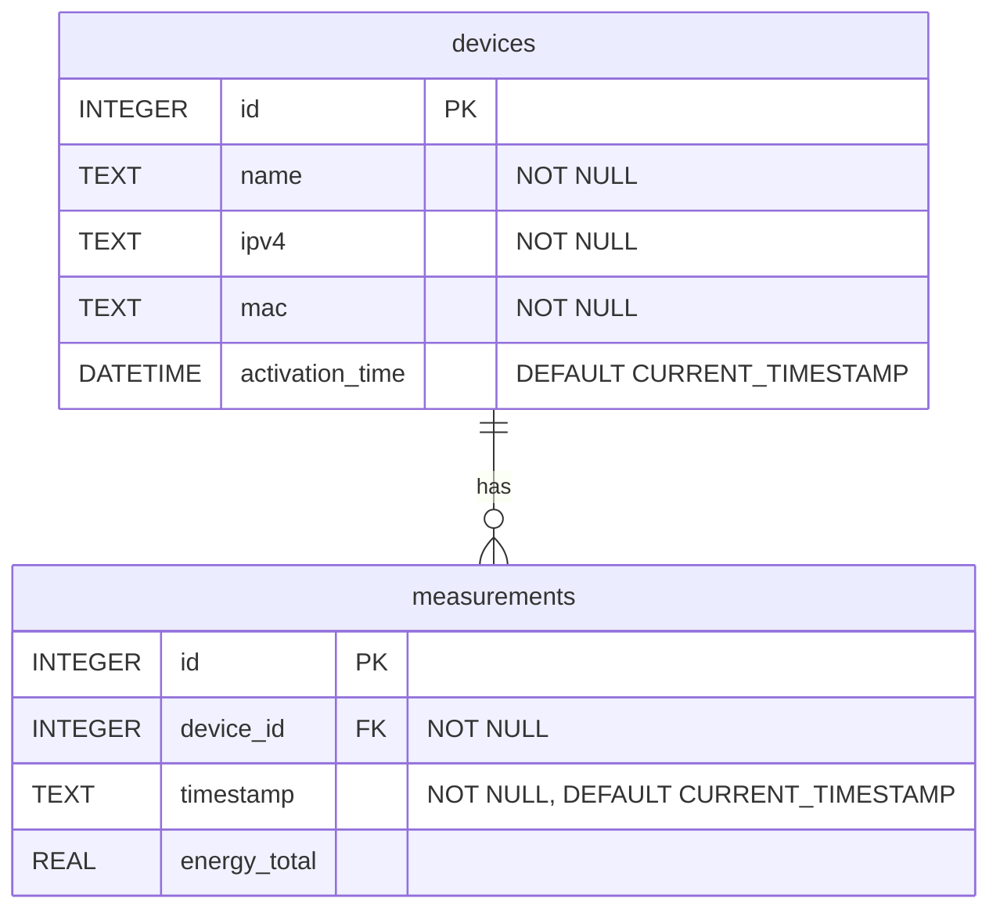
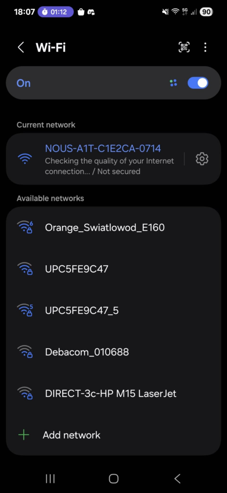
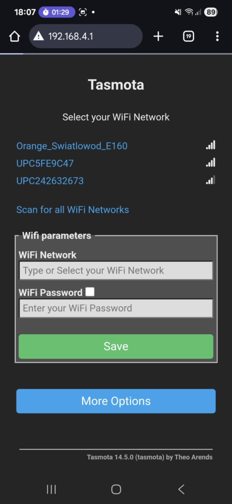
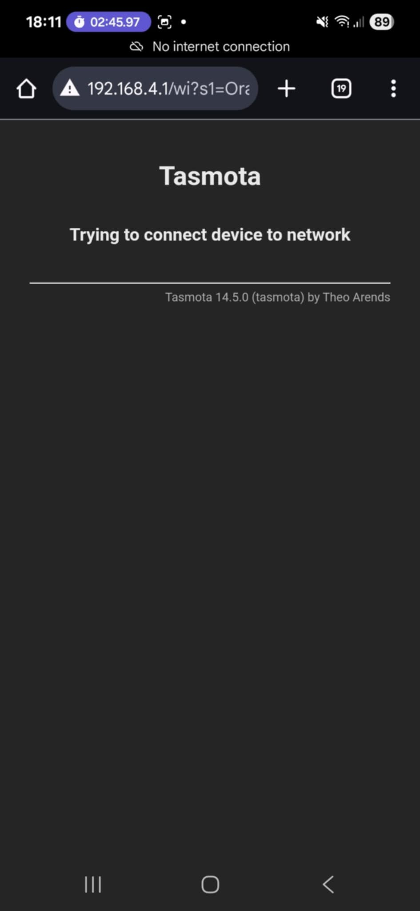
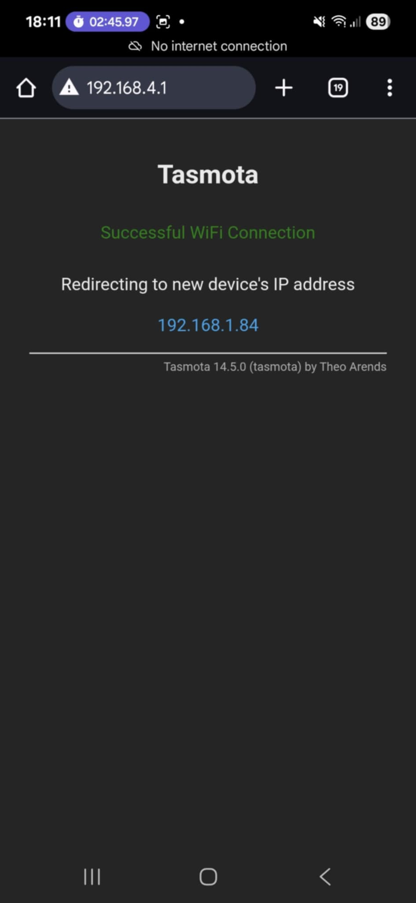

# App-Plug
Mobile app for smart-plug managing

# Connection
`ssh piotr@100.96.46.43`

# Architecture



# Database Schema



# Running the Project with Docker

To run the full workflow with both **backend** and **mobile app**, follow these steps:

### 1. Set the host IP in `.env`

Before building the containers, add your host machine’s local IP:

```env
HOST_IP=x.x.x.x
```

> Replace `x.x.x.x` with your local IP. This ensures the Expo app inside Docker generates a QR code your phone can access.

---

### 2. Build Docker containers

```bash
docker compose build
```

This installs dependencies and sets up the containers.

---

### 3. Start the containers

```bash
docker compose up
```

You will see logs for both:

* **Backend** – listening on port 8080
* **Mobile app** – Metro Bundler starting, waiting on Expo

---

### 4. Access the mobile app via Expo Go

1. Install **[Expo Go](https://expo.dev/client)** on your device.
2. Make sure your phone is on the same Wi-Fi as your host machine.
3. Look at **mobile-app container logs** – scan the QR code like:

```
exp://x.x.x.x:8081
```

4. The app should open in Expo Go.

---

### Notes

* `HOST_IP` in `.env` is critical – Expo uses it to generate QR codes reachable from your phone.


# Voice to text
https://www.npmjs.com/package/@appcitor/react-native-voice-to-text

# Business Overview

During the project, we identified a few weaknesses in the potential business plan.

## New Device Configuration Guide

1.  **Plug the smartplug into an electrical socket.**
    The device will power on and create its own temporary Wi-Fi network.

2.  **Connect your phone to the smartplug's temporary Wi-Fi network.**
    Look for a new, unsecured Wi-Fi network in your phone's settings and connect to it.
    
    

3.  **Navigate to `192.168.4.1` in your web browser to set up the connection to your home Wi-Fi.**
    Select your home network from the list and enter the password.
    
    
    <br>
    

4.  **Note the new IP address assigned by your home network.**
    Once connected, the device will be redirected to a new IP address on your local network.
    
    

5.  **Reconnect your phone to your home Wi-Fi network.**
    The setup is now complete. You can access the smartplug using its new IP address.

# Future Configuration Concept: Simplified Device Onboarding

To significantly enhance the user experience and reduce friction during setup, we propose a new, semi-automated device onboarding process. The goal is to eliminate the need for users to manually switch between Wi-Fi networks and to streamline the process of adding multiple devices.

### Core Mechanism: Dynamic & Encoded Wi-Fi Network Name (SSID)

The key innovation is embedding a unique, encoded identifier directly into the temporary Wi-Fi network name (SSID) that the device broadcasts upon being powered on. This identifier is derived from the device's power-on timestamp, making each broadcast unique and preventing collisions.

**SSID Structure:**
The network name will follow a unique, parsable format, allowing the app to identify and decode it.

`NOUS-A1T-b64(1763323672)`

**Format Breakdown:**
| Prefix | Model | Encoded Identifier |
| :--- | :---: | :--- |
| `NOUS-` | `A1T-` | `b64(1763323672)` |

**Identifier Generation and Encoding:**

To ensure the SSID is both unique and not trivially guessable, we will not use a plain-text timestamp. Instead, we will use a more robust method:

1.  **Timestamp as a Base:** Upon power-on, the device captures the current time as a Unix timestamp (e.g., `1763323672`, which corresponds to `16 Nov 2025 15:47:52`). This provides a highly granular and unique base value.

2.  **Encoding for Readability & Security:** The raw timestamp is then encoded. We can use `encoding algorithm`. This transforms the numeric timestamp into a compact alphanumeric string (e.g., `b64(1763323672)`). This step prevents users from seeing a long, confusing number and adds a slight layer of obfuscation.

3.  **App-side Decoding:** When the app scans and discovers a network like `NOUS-A1T-b64(...)`, it performs the reverse operation. It extracts the encoded part, decodes it back to the original Unix timestamp, and then converts it into a human-readable date and time for display in the UI.

This encoding/decoding mechanism is lightweight, fast, and ensures that each device has a distinct temporary identifier based on the precise moment it was powered on.

### User Workflow

1.  **One-Time App Setup**
    The user pre-configures their home Wi-Fi credentials (SSID and password) within the app's settings.

2.  **Powering On the New Device**
    The user plugs the new smartplug into an electrical socket. The device powers on and begins broadcasting its temporary Wi-Fi network with the unique, timestamped name.

3.  **Device Discovery in the App**
    The user navigates to the "Add New Device" screen in the app. The app automatically scans for nearby Wi-Fi networks matching the `NOUS-A1T-*` pattern.

4.  **Device Selection**
    A clear list of discovered devices is displayed, sorted by their power-on time.

| Connection Time | Company | Device Model |
| :--- | :---: | :---: |
| 15:43:22 12-11-2025 | NOUS | A1T |
| 15:45:22 12-11-2025 | NOUS | A1T |

5.  **Naming and Finalization**
    The user selects the correct device from the list (easily identified by the time it was plugged in) and assigns it a custom name, such as "Bedside Lamp."

6.  **Automated Background Configuration**
    Upon confirmation, the app executes an automated script in the background that:
    *   Connects to the smartplug's temporary Wi-Fi network.
    *   Transmits the previously saved home Wi-Fi credentials to the device.
    *   Waits for the smartplug to reconnect to the home network.
    *   Registers the device to the user's account.

### Technical Implementation: Automated Wi-Fi Provisioning

To streamline the onboarding process (especially for non-technical users), we plan to implement an in-app Wi-Fi connection handler using libraries like **`react-native-wifi-reborn`**. This eliminates the need to manually switch networks in system settings.

#### Implementation Strategy

**1. iOS (NetworkExtension Framework)**
*   **Mechanism:** Uses `NEHotspotConfigurationManager`.
*   **UX:** The user triggers the action in-app and must confirm a standard system dialog (*"App-Plug wants to join Wi-Fi Network NOUS-A1T..."*).
*   **Requirements:**
    *   Add `com.apple.developer.networking.HotspotConfiguration` entitlement in Xcode/Expo Config.

**2. Android (WifiNetworkSpecifier)**
*   **Mechanism:** Uses `WifiNetworkSpecifier` (Android 10+) to request a specific peer-to-peer connection with the IoT device without changing the global system network.
*   **UX:** A system panel requests user confirmation to connect to the specific device.
*   **Permissions Required:**
    *   `ACCESS_FINE_LOCATION` (Required for scanning on older Android versions).
    *   `NEARBY_WIFI_DEVICES` (Crucial for Android 13+ / API 33 compatibility).
    *   `CHANGE_WIFI_STATE`.

#### Development Roadmap
- Install and configure `react-native-wifi-reborn`.
- Update `app.json` (Expo) with required Android permissions and iOS entitlements.
- Implement the "Connect & Configure" flow:
    1.  App requests connection to `NOUS-A1T-*`.
    2.  User approves system prompt (One-Click action).
    3.  App sends HTTP POST with home Wi-Fi credentials to `192.168.4.1`.
    4.  App disconnects from the plug, automatically reverting to the home network.

### Key Benefits of This Approach

*   **Effortless Experience:** The user no longer needs to manually search for and connect to the device's temporary network.
*   **Error Reduction:** Minimizes the risk of typos when entering passwords or selecting the wrong network.
*   **Scalability:** Allows for the quick and easy addition of multiple devices in succession, without repeating tedious steps.
