# App-Plug
Mobile app for smart-plug managing

# Architecture

```mermaid
graph TD
    subgraph "VPN (Tailscale)"
        A[Mobile app]
    end
    B["<table style='border-collapse: separate; border-spacing: 0; background-color:#000000;'>
        <tr style='background-color:#4a90e2; color:white;'>
            <th>Action</th>
            <th>Command</th>
        </tr>
        <tr style='background-color:#000000;'>
            <td style='border:1px solid white;'>turn on</td>
            <td style='border:1px solid white;'>spc on [smartplug name]</td>
        </tr>
        <tr style='background-color:#000000;'>
            <td style='border:1px solid white;'>turn off</td>
            <td style='border:1px solid white;'>spc off [smartplug name]</td>
        </tr>
        <tr style='background-color:#000000;'>
            <td style='border:1px solid white;'>add device</td>
            <td style='border:1px solid white;'>spc add [smartplug name]</td>
        </tr>
        <tr style='background-color:#000000;'>
            <td style='border:1px solid white;'>remove device</td>
            <td style='border:1px solid white;'>spc remove [smartplug name]</td>
        </tr>
        <tr style='background-color:#000000;'>
            <td style='border:1px solid white;'>get state</td>
            <td style='border:1px solid white;'>spc state [smartplug name]</td>
        </tr>
        <tr style='background-color:#000000;'>
            <td style='border:1px solid white;'>get active power</td>
            <td style='border:1px solid white;'>spc active-power [smartplug name]</td>
        </tr>
        <tr style='background-color:#000000;'>
            <td style='border:1px solid white;'>get voltage</td>
            <td style='border:1px solid white;'>spc get-voltage [smartplug name]</td>
        </tr>
        <tr style='background-color:#000000;'>
            <td style='border:1px solid white;'>get current</td>
            <td style='border:1px solid white;'>spc get-current [smartplug name]</td>
        </tr>
        <tr style='background-color:#000000;'>
            <td style='border:1px solid white;'>get energy today</td>
            <td style='border:1px solid white;'>spc energy-today [smartplug name]</td>
        </tr>
        <tr style='background-color:#000000;'>
            <td style='border:1px solid white;'>get energy yesterday</td>
            <td style='border:1px solid white;'>spc energy-yesterday [smartplug name]</td>
        </tr>
        <tr style='background-color:#000000;'>
            <td style='border:1px solid white;'>get energy [from] [to]</td>
            <td style='border:1px solid white;'>spc-energy --name [smartplug name] --from [date] --to [date]</td>
        </tr>
         <tr style='background-color:#000000;'>
            <td style='border:1px solid white;'>rename device</td>
            <td style='border:1px solid white;'>spc rename [smartplug name]</td>
        </tr>
    </table>"]
    subgraph "Wi-Fi"
    subgraph "VPN (Tailscale)"
        subgraph "Raspberry PI Zero"
        C@{ shape: lin-cyl, label: "App Server" }
        D@{ shape: lin-cyl, label: "Database" }
        E@{ shape: lin-cyl, label: "MCP Server" }
    end
    classDef rpi fill:#003366,stroke:#66aaff,stroke-width:2px,color:white;
    class C,D,E rpi;
    end
        F@{ shape: circle, label: "Smartplug" }
    end

    A -- "Text action choosing" --> B
    A -- "Voice action choosing" --> E
    B -- "Request" --> C
    E -- "Text action choosing" --> B
    C -- "Database request" --> D
    D -- "Database Answer" --> C
    C -- "(If required) Curl request" --> F
    F -- "(If required) Curl request" --> C
    C -- "Answer" --> A

    linkStyle 0 stroke:#FF2C00,stroke-width:2px;
    linkStyle 1 stroke:#FFE500,stroke-width:2px;
    linkStyle 2 stroke:#FF8C00,stroke-width:2px;
    linkStyle 3 stroke:#FFE500,stroke-width:2px;
    linkStyle 4 stroke:#FF8C00,stroke-width:2px;
    linkStyle 5 stroke:#FF8C00,stroke-width:2px;
    linkStyle 6 stroke:#FF8C00,stroke-width:2px;
    linkStyle 7 stroke:#FF8C00,stroke-width:2px;
    linkStyle 8 stroke:#FF8C00,stroke-width:2px;
```



# Database schema

```mermaid
erDiagram
    devices {
        INTEGER id PK
        TEXT name "NOT NULL"
        TEXT ipv4 "NOT NULL"
        TEXT mac "NOT NULL"
        DATETIME activation_time "DEFAULT CURRENT_TIMESTAMP"
    }

    measurements {
        INTEGER id PK
        INTEGER device_id FK "NOT NULL"
        TEXT timestamp "NOT NULL, DEFAULT CURRENT_TIMESTAMP"
        REAL energy_total
    }

    devices ||--o{ measurements : "has"


