# App-Plug

Mobile app for smart-plug managing

# Connection

`ssh piotr@100.96.46.43`

# Architecture

```mermaid
graph TD
    subgraph "Internet"
        G["🌐 Gemini API<br/>(External)<br/>Decides which tool to call"]
    end

    subgraph "VPN (Tailscale)"
        A["📱 Mobile App"]

        subgraph "Raspberry Pi"
            E["MCP Client<br/>client.js<br/>(port 3001)"]
            C["MCP Server<br/>server.js<br/>(port 3000)"]
            D[("🗄️ SQLite Database")]

            subgraph "Tools - Shell Scripts"
                F1["spc-on / spc-off"]
                F2["spc-state / spc-voltage<br/>spc-current"]
                F3["spc-energy-today<br/>spc-energy-yesterday<br/>spc-energy"]
                F4["spc-add / spc-remove<br/>spc-rename"]
            end
        end

        H["🔌 Smartplug<br/>(Local Wi-Fi)"]
    end

    classDef rpi fill:#003366,stroke:#66aaff,stroke-width:2px,color:white;
    classDef external fill:#666,stroke:#999,stroke-width:2px,color:white;
    classDef mobile fill:#4a90e2,stroke:#66aaff,stroke-width:2px,color:white;

    class C,E,D,F1,F2,F3,F4 rpi;
    class G external;
    class A mobile;

    A -- "1. Voice/Text input<br/>(via Tailscale)" --> E
    E -- "2. Sends user request<br/>+ available tools" --> G
    G -- "3. Analyzes & chooses<br/>which tool to call<br/>Calls MCP tool" --> C
    C -- "4. Executes chosen<br/>shell script" --> F1
    C -- "4. Executes chosen<br/>shell script" --> F2
    C -- "4. Executes chosen<br/>shell script" --> F3
    C -- "4. Executes chosen<br/>shell script" --> F4
    F1 -- "5. curl requests" --> H
    F2 -- "5. curl requests" --> H
    F3 -- "5. curl requests" --> H
    F4 -- "5. curl requests/DB" --> H
    C -- "Database operations" --> D
    F1 -- "Save to DB" --> D
    F2 -- "Save to DB" --> D
    F3 -- "Read from DB" --> D
    F4 -- "Read/Write to DB" --> D
    C -- "6. Returns result" --> E
    E -- "7. Response to user" --> A

    linkStyle 0 stroke:#FF2C00,stroke-width:2px;
    linkStyle 1 stroke:#FFE500,stroke-width:2px;
    linkStyle 2 stroke:#FFE500,stroke-width:2px;
    linkStyle 3,4,5,6 stroke:#4CAF50,stroke-width:2px;
    linkStyle 7,8,9,10 stroke:#FFC107,stroke-width:2px;
    linkStyle 11,12,13,14,15 stroke:#2196F3,stroke-width:2px;
    linkStyle 16,17 stroke:#9C27B0,stroke-width:2px;
```



# Database Schema


# Running the Project with Docker

To run the full workflow with both **backend** and **mobile app**, follow these steps:

### 1. Set the host IP in `.env`

Before building the containers, add your host machine’s local IP:

```env
HOST_IP=x.x.x.x
```

> Replace `x.x.x.x` with your local IP. This ensures the Expo app inside Docker generates a QR code your phone can access.

---

### 2. Build Docker containers

```bash
docker compose build
```

This installs dependencies and sets up the containers.

---

### 3. Start the containers

```bash
docker compose up
```

You will see logs for both:

- **Backend** – listening on port 8080
- **Mobile app** – Metro Bundler starting, waiting on Expo

---

### 4. Access the mobile app via Expo Go

1. Install **[Expo Go](https://expo.dev/client)** on your device.
2. Make sure your phone is on the same Wi-Fi as your host machine.
3. Look at **mobile-app container logs** – scan the QR code like:

```
exp://x.x.x.x:8081
```

4. The app should open in Expo Go.

---

### Notes

- `HOST_IP` in `.env` is critical – Expo uses it to generate QR codes reachable from your phone.

# Mobile App

The **SmartPlugMobileApp** is a React Native mobile application built with Expo, providing an intuitive interface for managing smart plugs through voice and text commands. The app features real-time device control, energy monitoring, AI-powered voice assistance, and a modern dark-themed UI.

## Technology Stack

### Core Framework

- **Expo SDK ~54.0** - React Native framework for cross-platform mobile development
- **React Native 0.81.5** - Mobile UI framework
- **React 19.1.0** - UI library
- **TypeScript** - Type-safe JavaScript

### Navigation & Routing

- **Expo Router ~6.0** - File-based routing system
  - Stack navigation for main app screens
  - Tab navigation for home/explore sections
  - Authentication routing with protected routes

### State Management & Data Fetching

- **TanStack Query (React Query) v5** - Server state management
  - Automatic caching and background refetching
  - Optimistic updates for device operations
  - Query invalidation and cache management
- **React Context API** - Global state for toasts and UI feedback

### UI & Styling

- **NativeWind v4** - Tailwind CSS for React Native
- **Expo Vector Icons** - Icon library
- **React Native Gifted Charts** - Data visualization for energy graphs

### Key Libraries

- **Axios** - HTTP client for API requests
- **AsyncStorage** - Local data persistence
- **Expo AV** - Audio recording capabilities
- **Expo Speech Recognition** - Native speech-to-text functionality

## Project Structure

```
SmartPlugMobileApp/
├── app/                          # Expo Router file-based routes
│   ├── (auth)/                   # Authentication screens
│   │   ├── _layout.tsx          # Auth stack layout
│   │   └── login.tsx            # Login screen
│   ├── (main)/                   # Main app screens (protected)
│   │   ├── _layout.tsx          # Main stack layout
│   │   ├── index.tsx            # Device list screen
│   │   ├── add-device.tsx       # Add new device
│   │   └── device-details.tsx   # Device details & graphs
│   ├── (tabs)/                   # Tab navigation
│   │   ├── _layout.tsx          # Tab layout
│   │   ├── index.tsx            # Home tab
│   │   └── explore.tsx          # Explore tab
│   └── _layout.tsx              # Root layout with providers
│
├── src/
│   ├── components/              # Reusable UI components
│   │   ├── AiVoiceInputModal.tsx    # AI chat with voice input
│   │   ├── DeviceCard.tsx           # Device list item
│   │   ├── DeviceDetailsContent.tsx # Device info display
│   │   ├── DeviceGraphsContent.tsx  # Energy consumption graphs
│   │   ├── FloatingButton.tsx       # FAB for AI modal
│   │   ├── Toast.tsx                # Toast notification component
│   │   └── ChatMessage.tsx          # Chat message bubble
│   │
│   ├── hooks/                   # Custom React hooks
│   │   ├── useAuth.ts           # Authentication logic
│   │   ├── useDevices.ts        # Device data fetching (TanStack Query)
│   │   ├── useMcp.ts            # MCP client integration
│   │   └── useSpeechRecognition.ts  # Speech-to-text hook
│   │
│   ├── services/                # API & external services
│   │   ├── api.ts               # Axios instance & interceptors
│   │   ├── auth.ts              # Authentication API calls
│   │   ├── devices.ts           # Device management API
│   │   └── mcp.ts               # MCP client service
│   │
│   ├── contexts/                # React Context providers
│   │   └── ToastContext.tsx     # Global toast management
│   │
│   ├── types/                   # TypeScript type definitions
│   │   └── device.ts            # Device-related types
│   │
│   └── utils/                   # Utility functions
│       └── storage.ts           # AsyncStorage helpers
│
├── assets/                      # Static assets (images, icons)
├── app.json                     # Expo configuration
└── package.json                 # Dependencies & scripts
```

## Speech-to-Text Implementation

The app integrates **native speech recognition** using the `expo-speech-recognition` library, enabling users to control devices and interact with the AI assistant through voice commands.

### Architecture

The speech-to-text feature is implemented through a custom hook (`useSpeechRecognition`) that wraps the native Expo module, providing a React-friendly API for speech recognition.

### Key Components

#### 1. **useSpeechRecognition Hook** (`src/hooks/useSpeechRecognition.ts`)

A custom hook that manages the speech recognition lifecycle:

- **Features:**

  - Continuous listening mode
  - Real-time interim results (live transcription)
  - Final transcript processing
  - Error handling and permission management
  - Event-driven architecture using `useSpeechRecognitionEvent`

- **API:**
  ```typescript
  const {
    isListening, // Current listening state
    transcript, // Current transcript text
    isFinal, // Whether result is final
    error, // Error message if any
    startListening, // Start recognition
    stopListening, // Stop recognition
    cancel, // Cancel and clear
    abort, // Abort recognition
  } = useSpeechRecognition({
    continuous: true, // Keep listening
    interimResults: true, // Get partial results
    lang: "en-US", // Language code
    onResult: (text, isFinal) => {
      /* handle transcript */
    },
    onError: (error) => {
      /* handle errors */
    },
  });
  ```

#### 2. **AiVoiceInputModal Component** (`src/components/AiVoiceInputModal.tsx`)

A chat-like interface that combines voice input with text messaging:

- **Features:**

  - Live transcription display in input field
  - Dual input modes: voice recording and text typing
  - Scrollable message history
  - Keyboard-aware layout
  - Integration with MCP client for AI responses
  - Recording indicator with visual feedback

- **User Flow:**
  1. User taps microphone button → Starts recording and speech recognition
  2. Speech is transcribed in real-time → Text appears in input field
  3. User taps stop/send → Stops recording, sends message to AI
  4. AI response appears → Added to chat history

### Native Module Requirements

**Important:** Speech recognition requires native code compilation. The app must be built as a **development build**, not used with Expo Go.

**Build Steps:**

1. Install dependencies: `npm install`
2. Generate native projects: `npx expo prebuild`
3. Build for iOS: `npx expo run:ios`
4. Build for Android: `npx expo run:android`

**Note:** Expo Go does not support custom native modules like `expo-speech-recognition`.

### How It Works

1. **Permission Request:** On first use, the app requests microphone and speech recognition permissions
2. **Start Recognition:** `ExpoSpeechRecognitionModule.start()` initiates native speech recognition
3. **Event Handling:** Results are received via `useSpeechRecognitionEvent` hooks:
   - `"start"` - Recognition started
   - `"result"` - Transcript received (interim or final)
   - `"end"` - Recognition ended
   - `"error"` - Error occurred
4. **Real-time Updates:** Interim results update the input field live as the user speaks
5. **Final Processing:** When recognition ends, the final transcript is available for sending

## State Management & Data Fetching

### TanStack Query Integration

The app uses **TanStack Query** for all server state management, providing:

- **Automatic Caching:** Device data is cached and reused across screens
- **Background Refetching:** Data refreshes when the app comes to foreground
- **Optimistic Updates:** Device toggle/rename/delete operations update UI immediately
- **Query Invalidation:** Related queries are invalidated after mutations

#### Query Keys Structure

```typescript
deviceKeys = {
  all: ["devices"],
  lists: () => ["devices", "list"],
  detail: (id) => ["devices", "detail", id],
  stats: (id) => ["devices", "stats", id],
  // ... more keys for energy data, state, etc.
};
```

#### Example: Device Operations

```typescript
// Fetch devices
const { data: devices, isLoading } = useDevices();

// Toggle device (mutation)
const { mutateAsync: toggleDevice } = useToggleDevice();

// Optimistic update: UI updates immediately
// On success: Cache is invalidated and refetched
// On error: Rollback to previous state + error toast
```

### Toast Notifications

A global toast system provides user feedback for all operations:

- **Types:** `pending`, `success`, `error`
- **Position:** Bottom-left with slide-in animation
- **Integration:** Automatically shown during TanStack Query mutations
- **Customization:** Configurable message, duration, and dismiss behavior

## API Integration

### API Client (`src/services/api.ts`)

- **Base URL:** Configurable via `EXPO_PUBLIC_API_BASE_URL` environment variable
- **Interceptors:**
  - Request: Adds authentication token from AsyncStorage
  - Response: Handles 401 unauthorized errors
- **Timeout:** 10 seconds default

### Device Service (`src/services/devices.ts`)

Provides methods for all device operations:

- `getDevices()` - Fetch all devices with their states
- `getDevice(id)` - Fetch single device details
- `toggleDevice(id)` - Toggle device on/off
- `renameDevice(name, newName)` - Rename device
- `deleteDevice(name)` - Remove device
- Energy data methods: `getTodayConsumption`, `getHistory`, `getVoltage`, etc.

## Building & Development

### Development Setup

1. **Install Dependencies:**

   ```bash
   cd SmartPlugMobileApp
   npm install
   ```

2. **Configure Environment:**
   Create `.env` file:

   ```env
   EXPO_PUBLIC_API_BASE_URL=http://your-backend-url:8080
   ```

3. **Start Development Server:**
   ```bash
   npm start
   # Or with Docker: docker compose up mobile-app
   ```

### Building for Production

#### iOS

```bash
# Generate native projects
npx expo prebuild

# Build for device/simulator
npx expo run:ios

# Or build standalone with EAS
eas build --platform ios
```

#### Android

```bash
# Generate native projects
npx expo prebuild

# Build for device/emulator
npx expo run:android

# Or build standalone with EAS
eas build --platform android
```

### Docker Development

The mobile app runs in a Docker container for consistent development:

- **Ports:**

  - `8081` - Metro bundler
  - `19000` - Expo protocol
  - `19002` - DevTools web interface

- **Volumes:**

  - `./SmartPlugMobileApp:/app` - Source code (hot reload)
  - `/app/node_modules` - Dependencies (cached)
  - `/app/.expo` - Expo cache

- **Environment Variables:**
  - `EXPO_PUBLIC_API_BASE_URL` - Backend API URL (must be host machine IP for Expo Go)
  - `REACT_NATIVE_PACKAGER_HOSTNAME` - Metro bundler hostname

## Key Features

### 1. Device Management

- View all devices in a scrollable list
- Toggle devices on/off with instant feedback
- Rename devices with inline editing
- Delete devices with confirmation
- Real-time state updates

### 2. Device Details

- View device information (IP, MAC, activation time)
- Monitor real-time energy consumption
- View historical graphs (1 day, 1 week, 1 month)
- Track voltage, current, and power metrics

### 3. AI Voice Assistant

- Voice-to-text transcription
- Text input fallback
- Chat-like conversation interface
- Integration with MCP client for device control
- Natural language device commands

### 4. User Experience

- Dark theme UI (consistent `#121212` background)
- Smooth animations and transitions
- Toast notifications for all operations
- Pull-to-refresh on device list
- Loading states and error handling
- Keyboard-aware layouts

---

# Business Overview

During the project, we identified a few weaknesses in the potential business plan.

## New Device Configuration Guide

1.  **Plug the smartplug into an electrical socket.**
    The device will power on and create its own temporary Wi-Fi network.

2.  **Connect your phone to the smartplug's temporary Wi-Fi network.**
    Look for a new, unsecured Wi-Fi network in your phone's settings and connect to it.

    

3.  **Navigate to `192.168.4.1` in your web browser to set up the connection to your home Wi-Fi.**
    Select your home network from the list and enter the password.

    
    <br>
    

4.  **Note the new IP address assigned by your home network.**
    Once connected, the device will be redirected to a new IP address on your local network.

    

5.  **Reconnect your phone to your home Wi-Fi network.**
    The setup is now complete. You can access the smartplug using its new IP address.

# Future Configuration Concept: Simplified Device Onboarding

To significantly enhance the user experience and reduce friction during setup, we propose a new, semi-automated device onboarding process. The goal is to eliminate the need for users to manually switch between Wi-Fi networks and to streamline the process of adding multiple devices.

### Core Mechanism: Dynamic & Encoded Wi-Fi Network Name (SSID)

The key innovation is embedding a unique, encoded identifier directly into the temporary Wi-Fi network name (SSID) that the device broadcasts upon being powered on. This identifier is derived from the device's power-on timestamp, making each broadcast unique and preventing collisions.

**SSID Structure:**
The network name will follow a unique, parsable format, allowing the app to identify and decode it.

`NOUS-A1T-b64(1763323672)`

**Format Breakdown:**
| Prefix | Model | Encoded Identifier |
| :--- | :---: | :--- |
| `NOUS-` | `A1T-` | `b64(1763323672)` |

**Identifier Generation and Encoding:**

To ensure the SSID is both unique and not trivially guessable, we will not use a plain-text timestamp. Instead, we will use a more robust method:

1.  **Timestamp as a Base:** Upon power-on, the device captures the current time as a Unix timestamp (e.g., `1763323672`, which corresponds to `16 Nov 2025 15:47:52`). This provides a highly granular and unique base value.

2.  **Encoding for Readability & Security:** The raw timestamp is then encoded. We can use `encoding algorithm`. This transforms the numeric timestamp into a compact alphanumeric string (e.g., `b64(1763323672)`). This step prevents users from seeing a long, confusing number and adds a slight layer of obfuscation.

3.  **App-side Decoding:** When the app scans and discovers a network like `NOUS-A1T-b64(...)`, it performs the reverse operation. It extracts the encoded part, decodes it back to the original Unix timestamp, and then converts it into a human-readable date and time for display in the UI.

This encoding/decoding mechanism is lightweight, fast, and ensures that each device has a distinct temporary identifier based on the precise moment it was powered on.

### User Workflow

1.  **One-Time App Setup**
    The user pre-configures their home Wi-Fi credentials (SSID and password) within the app's settings.

2.  **Powering On the New Device**
    The user plugs the new smartplug into an electrical socket. The device powers on and begins broadcasting its temporary Wi-Fi network with the unique, timestamped name.

3.  **Device Discovery in the App**
    The user navigates to the "Add New Device" screen in the app. The app automatically scans for nearby Wi-Fi networks matching the `NOUS-A1T-*` pattern.

4.  **Device Selection**
    A clear list of discovered devices is displayed, sorted by their power-on time.

| Connection Time     | Company | Device Model |
| :------------------ | :-----: | :----------: |
| 15:43:22 12-11-2025 |  NOUS   |     A1T      |
| 15:45:22 12-11-2025 |  NOUS   |     A1T      |

5.  **Naming and Finalization**
    The user selects the correct device from the list (easily identified by the time it was plugged in) and assigns it a custom name, such as "Bedside Lamp."

6.  **Automated Background Configuration**
    Upon confirmation, the app executes an automated script in the background that:
    - Connects to the smartplug's temporary Wi-Fi network.
    - Transmits the previously saved home Wi-Fi credentials to the device.
    - Waits for the smartplug to reconnect to the home network.
    - Registers the device to the user's account.

### Technical Implementation: Automated Wi-Fi Provisioning

To streamline the onboarding process (especially for non-technical users), we plan to implement an in-app Wi-Fi connection handler using libraries like **`react-native-wifi-reborn`**. This eliminates the need to manually switch networks in system settings.

#### Implementation Strategy

**1. iOS (NetworkExtension Framework)**

- **Mechanism:** Uses `NEHotspotConfigurationManager`.
- **UX:** The user triggers the action in-app and must confirm a standard system dialog (_"App-Plug wants to join Wi-Fi Network NOUS-A1T..."_).
- **Requirements:**
  - Add `com.apple.developer.networking.HotspotConfiguration` entitlement in Xcode/Expo Config.

**2. Android (WifiNetworkSpecifier)**

- **Mechanism:** Uses `WifiNetworkSpecifier` (Android 10+) to request a specific peer-to-peer connection with the IoT device without changing the global system network.
- **UX:** A system panel requests user confirmation to connect to the specific device.
- **Permissions Required:**
  - `ACCESS_FINE_LOCATION` (Required for scanning on older Android versions).
  - `NEARBY_WIFI_DEVICES` (Crucial for Android 13+ / API 33 compatibility).
  - `CHANGE_WIFI_STATE`.

#### Development Roadmap

- Install and configure `react-native-wifi-reborn`.
- Update `app.json` (Expo) with required Android permissions and iOS entitlements.
- Implement the "Connect & Configure" flow:
  1.  App requests connection to `NOUS-A1T-*`.
  2.  User approves system prompt (One-Click action).
  3.  App sends HTTP POST with home Wi-Fi credentials to `192.168.4.1`.
  4.  App disconnects from the plug, automatically reverting to the home network.

### Key Benefits of This Approach

- **Effortless Experience:** The user no longer needs to manually search for and connect to the device's temporary network.
- **Error Reduction:** Minimizes the risk of typos when entering passwords or selecting the wrong network.
- **Scalability:** Allows for the quick and easy addition of multiple devices in succession, without repeating tedious steps.
