# App-Plug
Mobile app for smart-plug managing

# Connection
`ssh piotr@100.96.46.43`

# Architecture

```mermaid
graph TD
    subgraph "Internet"
        G["🌐 Gemini API<br/>(External)<br/>Decides which tool to call"]
    end

    subgraph "VPN (Tailscale)"
        A["📱 Mobile App"]

        subgraph "Raspberry Pi"
            E["MCP Client<br/>client.js<br/>(port 3001)"]
            C["MCP Server<br/>server.js<br/>(port 3000)"]
            D[("🗄️ SQLite Database")]

            subgraph "Tools - Shell Scripts"
                F1["spc-on / spc-off"]
                F2["spc-state / spc-voltage<br/>spc-current"]
                F3["spc-energy-today<br/>spc-energy-yesterday<br/>spc-energy"]
                F4["spc-add / spc-remove<br/>spc-rename"]
            end
        end

        H["🔌 Smartplug<br/>(Local Wi-Fi)"]
    end

    classDef rpi fill:#003366,stroke:#66aaff,stroke-width:2px,color:white;
    classDef external fill:#666,stroke:#999,stroke-width:2px,color:white;
    classDef mobile fill:#4a90e2,stroke:#66aaff,stroke-width:2px,color:white;

    class C,E,D,F1,F2,F3,F4 rpi;
    class G external;
    class A mobile;

    A -- "1. Voice/Text input<br/>(via Tailscale)" --> E
    E -- "2. Sends user request<br/>+ available tools" --> G
    G -- "3. Analyzes & chooses<br/>which tool to call<br/>Calls MCP tool" --> C
    C -- "4. Executes chosen<br/>shell script" --> F1
    C -- "4. Executes chosen<br/>shell script" --> F2
    C -- "4. Executes chosen<br/>shell script" --> F3
    C -- "4. Executes chosen<br/>shell script" --> F4
    F1 -- "5. curl requests" --> H
    F2 -- "5. curl requests" --> H
    F3 -- "5. curl requests" --> H
    F4 -- "5. curl requests/DB" --> H
    C -- "Database operations" --> D
    F1 -- "Save to DB" --> D
    F2 -- "Save to DB" --> D
    F3 -- "Read from DB" --> D
    F4 -- "Read/Write to DB" --> D
    C -- "6. Returns result" --> E
    E -- "7. Response to user" --> A

    linkStyle 0 stroke:#FF2C00,stroke-width:2px;
    linkStyle 1 stroke:#FFE500,stroke-width:2px;
    linkStyle 2 stroke:#FFE500,stroke-width:2px;
    linkStyle 3,4,5,6 stroke:#4CAF50,stroke-width:2px;
    linkStyle 7,8,9,10 stroke:#FFC107,stroke-width:2px;
    linkStyle 11,12,13,14,15 stroke:#2196F3,stroke-width:2px;
    linkStyle 16,17 stroke:#9C27B0,stroke-width:2px;
```

# Database Schema

# Voice to text
https://www.npmjs.com/package/@appcitor/react-native-voice-to-text